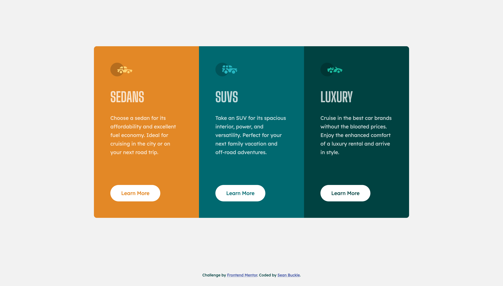

# Multi-Column | Vehicle Showcase Component 🏎️
A high-performance, responsive layout showcase featuring a trio of distinct product categories. This project highlights specialised CSS Grid implementations and a modular SCSS approach to manage multi-thematic UI components within a unified design system.

# 📸 Preview



## 🚀 Technical Highlights

- **Layout Engine:** Leverages CSS Grid for the primary three-column distribution, providing precise control over column spanning and alignment.
- **Styling Architecture:** Modular SCSS utilising the BEM (Block Element Modifier) methodology to ensure isolated component logic.
- **Thematic Variable System:** Centralised SCSS variables manage the distinct color palettes (Bright Orange, Dark Cyan, and Very Dark Cyan) through a DRY (Don't Repeat Yourself) architecture.
- **Markup Architecture:** Pure HTML5 using semantic elements to ensure a logical document outline and improved SEO.
- **Responsive Strategy:** A mobile-first workflow that gracefully transitions from a single-column stack to a balanced horizontal grid.

## 🏗️ Architectural Overview

### 1. Grid System & Responsiveness

The core of this component is its structural flexibility:
- **Fractional Units:** Used grid-template-columns: repeat(3, 1fr) on desktop to ensure perfectly equal distributions regardless of content length.
- **Layout Pivot:** Implemented a seamless breakpoint strategy that collapses the grid into a single column for mobile users, optimising readability and touch targets.

### 2. Modular SCSS & BEM

Following your suite's standard for maintainability:
- **Component Encapsulation:** The .vehicle-card block contains all shared logic, while modifiers like --sedan or --luxury handle the specific thematic color injections.
- **Interactive States:** Custom-engineered hover transitions for the 'Learn More' buttons, utilising inverse color schemes to provide clear visual affordance.
- **Typography Management:** Integrated Google Fonts (Lexend Deca and Big Shoulders Display) with specific attention to letter-spacing and line-height for a premium, editorial feel.

### 3. Accessibility & Performance

- **Logical Flow:** The heading structure is optimised for screen readers, ensuring a clear hierarchy of information.
- **Contrast Ratios:** Each theme is tested for WCAG contrast compliance, ensuring that the white text remains legible against the vibrant background colors.
- **Optimisation:** Zero-dependency CSS and optimised SVG assets ensure a perfect Lighthouse performance score.

## 🛠️ Built With


## 🔗 Live Implementation

- **Live Site:** [https://3-column-preview-card-component.seanbuckle.com](https://3-column-preview-card-component.seanbuckle.com)
- **Source Code:** [https://github.com/seanbuckle/3-column-preview-card-component](https://github.com/seanbuckle/3-column-preview-card-component)

## 🏁 Installation & Development
To run this project locally:

1. **Clone the repository:**

```bash
git clone https://github.com/seanbuckle/3-column-preview-card-component.git
```

2. **Navigate to the directory:**

```bash
cd 3-column-preview-card-component
```

3. **Open the project:** Simply open `index.html` in your preferred browser.

## 👨‍💻 Author

**Sean Buckle**

[Frontend Mentor Profile](https://www.frontendmentor.io/profile/seanbuckle)

[LinkedIn](https://www.linkedin.com/in/seanbuckle)

📜 License
This project is licensed under the MIT License - see the [LICENSE](https://github.com/seanbuckle/3-column-preview-card-component/blob/main/LICENSE) file for details.

---

***Note: This project was built as a solution to a Frontend Mentor challenge.***
